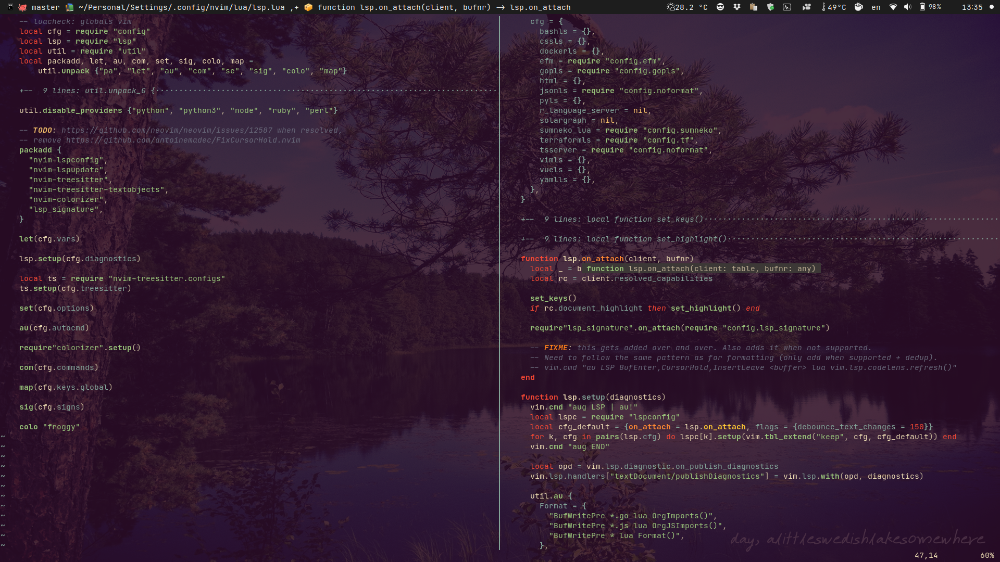

# Neovim config

Requires `nightly`. Features:

- 100% ~~Lua~~ [Fennel](https://fennel-lang.org) based (well, technically, it's still Lua ;-)) using my own, "nano" [Fennel shim](https://github.com/alexaandru/fennel-nvim);
- **syntax highlighting** (as well as **code folding**, **incremental selection**, **text objects** & more)
  powered by [TreeSitter](https://github.com/nvim-treesitter/nvim-treesitter);
- builtin [LSP](https://neovim.io/doc/user/lsp.html) setup for a dozen languages, of which I mostly use Go,
  JavaScript, Terraform and Fennel :-);
- dual LSP setup, (mostly) via [EFM](https://github.com/mattn/efm-langserver) to cover for "gaps", where needed,
  i.e.: I use `tsserver` for **JS**, but prefer `prettier` for formatting; I use `gopls` for **Go**, but I also
  want warnings from `golangci-lint-ls`, etc.;
- autoformat wherever possible; organize imports for **Go** and **JS**;
- builtin "fuzzy" searching (`set path=**` and just use `:find *whatever*` for filenames or `:Grep *whatever*`
  (set to `git grep`) for content) but ALSO using [fzf-lua](https://github.com/ibhagwan/fzf-lua);
- **git** integration: only a custom visual diff, [gitsigns](https://github.com/lewis6991/gitsigns.nvim)
  and for the rest I just `:!git` away;
- terminal started via `:Term` or `<C-Enter>` will start in the folder of the current file;
- minimal config that's been battle tested on the nightly branch since June 2020;
  no package manager, using builtin [packages](https://neovim.io/doc/user/repeat.html#packages) feature +
  git submodules for managing the plugins;
- minimal UI (no statusbar/linenumber; git branch, filename and function/method name are in the titlebar),
  using [my own colorscheme](https://github.com/alexaandru/froggy) and my own input and select overrides;
- autocompletion offered by [my fork](https://github.com/alexaandru/nvim-lsp-compl-fnl) of
  [nvim-lsp-compl](https://github.com/mfussenegger/nvim-lsp-compl) - I just had to rewrite it in Fennel, for fun... :-)

